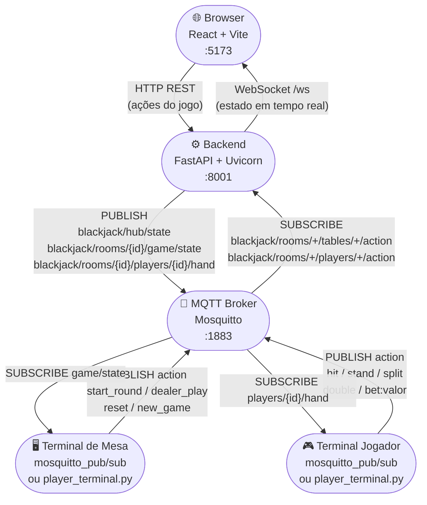

# Blackjack IoT (Multi-Room + MQTT)

Servidor e dashboard de Blackjack em tempo real, com arquitetura de terminais:

- Hub: gerencia mesas (salas)
- Terminal de mesa: controla rodada
- Terminais de jogador: enviam ações e recebem estado da mão

Comunicacao principal:

```text
Browser Hub/Table/Player  <->  FastAPI + WebSocket  <->  MQTT (Mosquitto)
```

Importante: este projeto nao usa mais reconhecimento de cartas por camera/OCR no fluxo principal do jogo.

---

## Arquitetura — Fluxograma



### Como funciona na prática

Ha dois caminhos para disparar uma acao no jogo:

**Caminho 1 — Browser (HTTP + WebSocket)**

```
Browser clica "Hit"
  → POST /rooms/{id}/game/players/{pid}/hit  (HTTP)
  → Backend processa a acao
  → Backend chama broadcast()
      ├─ WebSocket: envia estado atualizado para todos os browsers na sala
      └─ MQTT PUBLISH: blackjack/rooms/{id}/game/state
```

**Caminho 2 — Terminal MQTT externo (mosquitto_pub ou script)**

```
Terminal publica em blackjack/rooms/{id}/players/{pid}/action  "hit"
  → Broker entrega ao backend (SUBSCRIBE ativo)
  → Backend callback: _mqtt_player_action_callback()
  → Backend processa a acao (mesmo handler do caminho 1)
  → Backend chama broadcast()
      ├─ WebSocket: atualiza todos os browsers
      └─ MQTT PUBLISH: game/state + players/{pid}/hand
```

O resultado final e identico nos dois caminhos: o estado e sincronizado via WS para a UI e via MQTT para terminais externos.

---

## Stack

| Camada | Tecnologias |
|---|---|
| Backend | Python 3.11+, FastAPI, Uvicorn, Paho-MQTT |
| Frontend | React 18, Vite, Axios |
| Broker | Mosquitto 2.x |
| Containers | Docker + Docker Compose |

---

## Arquitetura Atual

Cada sala possui:

- `room_id` unico
- `table_terminal_id` (ex.: `table-mesa-principal`)
- estado completo do jogo
- ate 5 jogadores por mesa

O backend:

- publica estado consolidado no MQTT por sala
- publica estado individual de cada jogador
- recebe acao de jogador e de mesa via topicos MQTT
- transmite estado para UI via WebSocket (`/ws?room_id=...`)

Controle de propriedade dos terminais:

- cada browser recebe um `device_id`
- requests enviam `X-Device-ID`
- o backend bloqueia controle de jogador criado por outro dispositivo (403)
- um mesmo dispositivo pode criar/controlar varios jogadores proprios

---

## Estrutura do Projeto

```text
IOT-BLACKJACK/
├── backend/
│   ├── app/
│   │   ├── main.py          # API REST + WS + bridge MQTT
│   │   ├── game_engine.py   # Motor do blackjack (server-driven)
│   │   ├── room_manager.py  # Registro e ciclo de vida das salas
│   │   ├── mqtt_manager.py  # Pub/Sub MQTT por topicos de sala
│   │   ├── config.py
│   │   └── logger.py
│   ├── requirements.txt
│   └── run.py
├── frontend/
│   ├── src/
│   │   ├── App.jsx
│   │   ├── api.js
│   │   ├── hooks/useWebSocket.js
│   │   ├── components/
│   │   │   ├── HubView.jsx
│   │   │   ├── Table.jsx
│   │   │   ├── CreateRoomModal.jsx
│   │   │   └── AddPlayerModal.jsx
│   │   └── utils/deviceId.js
│   ├── vite.config.js
│   └── Dockerfile
├── mosquitto/mosquitto.conf
├── docker-compose.yml
├── start.sh
├── start.bat
└── README.md
```

---

## Topicos MQTT — Mapa Completo

### Publicados pelo backend (OUTPUT)

| Topico | Quando publica | Conteudo |
|---|---|---|
| `blackjack/hub/state` | Toda vez que qualquer sala muda | JSON com resumo de todas as salas |
| `blackjack/rooms/{room_id}/game/state` | Toda acao de jogo em uma sala | JSON completo da mesa (dealer + jogadores + status) |
| `blackjack/rooms/{room_id}/players/{player_id}/hand` | Acao que afeta um jogador especifico | JSON com a mao, valor, status e saldo do jogador |

### Assinados pelo backend (INPUT)

| Topico | Quem publica | Payload aceito |
|---|---|---|
| `blackjack/rooms/{room_id}/players/{player_id}/action` | Terminal do jogador | `hit` \| `stand` \| `split` \| `double` \| `bet:50` |
| `blackjack/rooms/{room_id}/tables/{table_id}/action` | Terminal de mesa | JSON `{"action": "..."}` ou string simples |

#### Acoes validas para o terminal de mesa

| Acao | Efeito |
|---|---|
| `start_round` | Inicia a rodada (distribui cartas) |
| `dealer_play` | Dealer joga automaticamente ate >= 17 |
| `reset` | Reseta a rodada atual, mantendo jogadores |
| `new_game` | Reinicia o jogo completo |
| `add_player` | Adiciona jogador (payload: `{"action":"add_player","name":"...","player_id":"..."}`) |
| `remove_player` | Remove jogador (payload: `{"action":"remove_player","player_id":"..."}`) |

#### Acoes validas para o terminal de jogador

| Acao | Efeito |
|---|---|
| `hit` | Pedir mais uma carta |
| `stand` | Parar (passar a vez) |
| `split` | Dividir par em duas maos |
| `double` | Dobrar aposta e receber exatamente uma carta |
| `bet:50` | Apostar 50 fichas (substituir pelo valor desejado) |

---

## Endpoints Principais

### Infra

- `GET /health`
- `GET /docs`
- `WS /ws?room_id={id}`

### Salas

- `GET /rooms`
- `POST /rooms`
- `GET /rooms/{room_id}`
- `DELETE /rooms/{room_id}` (exceto `mesa-principal`)

### Jogo por sala

- `GET /rooms/{room_id}/game/state`
- `POST /rooms/{room_id}/game/players`
- `DELETE /rooms/{room_id}/game/players/{player_id}`
- `POST /rooms/{room_id}/game/players/{player_id}/bet`
- `POST /rooms/{room_id}/game/start`
- `POST /rooms/{room_id}/game/players/{player_id}/hit`
- `POST /rooms/{room_id}/game/players/{player_id}/stand`
- `POST /rooms/{room_id}/game/players/{player_id}/split`
- `POST /rooms/{room_id}/game/players/{player_id}/double`
- `POST /rooms/{room_id}/game/dealer/play`
- `POST /rooms/{room_id}/game/reset`
- `POST /rooms/{room_id}/game/new-game`

Obs.: tambem existem rotas equivalentes sem `room_id`, operando na sala padrao `mesa-principal`.

---

## Pre-requisitos

- Python 3.11+
- Node.js 20+
- Mosquitto (broker MQTT)
- opcional: Docker + Docker Compose

### Instalar Mosquitto

Linux (Debian/Ubuntu):

```bash
sudo apt install mosquitto mosquitto-clients
```

macOS:

```bash
brew install mosquitto
```

Windows:

- https://mosquitto.org/download/

---

## Execucao em Desenvolvimento

### Script automatico (recomendado)

Linux/macOS:

```bash
chmod +x start.sh
./start.sh
```

Windows:

```bat
start.bat
```

### Manual (3 terminais)

1. Broker MQTT

```bash
mosquitto -c mosquitto/mosquitto.conf -v
```

2. Backend

```bash
cd backend
python3 -m venv venv
source venv/bin/activate
pip install -r requirements.txt
uvicorn app.main:app --host 0.0.0.0 --port 8001 --reload
```

3. Frontend

```bash
cd frontend
npm install
npm run dev
```

---

## Docker

```bash
docker-compose up --build
```

Servicos:

- Frontend: `http://localhost:5173`
- Backend: `http://localhost:8001`
- Docs: `http://localhost:8001/docs`
- MQTT: `localhost:1883`

---

## Monitoramento MQTT

### Pre-requisito

```bash
# Ubuntu/Debian
sudo apt install mosquitto-clients

# macOS
brew install mosquitto
```

### Escutar tudo (debug geral)

```bash
mosquitto_sub -h localhost -p 1883 -t "blackjack/#" -v
```

### Escutar somente o hub (lista de salas)

```bash
mosquitto_sub -h localhost -p 1883 -t "blackjack/hub/state" -v
```

### Escutar estado de uma sala especifica

```bash
mosquitto_sub -h localhost -p 1883 \
  -t "blackjack/rooms/mesa-principal/game/state" -v
```

### Escutar mao de um jogador especifico

```bash
mosquitto_sub -h localhost -p 1883 \
  -t "blackjack/rooms/mesa-principal/players/p1/hand" -v
```

### Escutar todos os eventos de uma sala (estado + maos)

```bash
mosquitto_sub -h localhost -p 1883 \
  -t "blackjack/rooms/mesa-principal/#" -v
```

### Verificar se o broker esta no ar

```bash
mosquitto_pub -h localhost -p 1883 -t "blackjack/test" -m "ping"
mosquitto_sub -h localhost -p 1883 -t "blackjack/test" -C 1
# Deve imprimir: blackjack/test ping
```

---

## Operacao via MQTT (sem o browser)

Tudo que o browser faz tambem pode ser feito publicando nos topicos MQTT.

### Adicionar jogador

```bash
mosquitto_pub -h localhost -p 1883 \
  -t "blackjack/rooms/mesa-principal/tables/table-mesa-principal/action" \
  -m '{"action":"add_player","name":"Joao","player_id":"p1"}'
```

### Iniciar rodada

```bash
mosquitto_pub -h localhost -p 1883 \
  -t "blackjack/rooms/mesa-principal/tables/table-mesa-principal/action" \
  -m '{"action":"start_round"}'
```

### Jogador apostar

```bash
mosquitto_pub -h localhost -p 1883 \
  -t "blackjack/rooms/mesa-principal/players/p1/action" \
  -m "bet:50"
```

### Jogador pedir carta

```bash
mosquitto_pub -h localhost -p 1883 \
  -t "blackjack/rooms/mesa-principal/players/p1/action" \
  -m "hit"
```

### Jogador parar

```bash
mosquitto_pub -h localhost -p 1883 \
  -t "blackjack/rooms/mesa-principal/players/p1/action" \
  -m "stand"
```

### Dealer jogar

```bash
mosquitto_pub -h localhost -p 1883 \
  -t "blackjack/rooms/mesa-principal/tables/table-mesa-principal/action" \
  -m '{"action":"dealer_play"}'
```

### Resetar rodada

```bash
mosquitto_pub -h localhost -p 1883 \
  -t "blackjack/rooms/mesa-principal/tables/table-mesa-principal/action" \
  -m '{"action":"reset"}'
```

### Usar o script de terminal incluso no projeto

```bash
# Em um terminal separado, assina a mao do jogador p1 e envia comandos interativos
python3 player_terminal.py p1

# Comandos aceitos no terminal interativo:
#   h  -> hit
#   s  -> stand
#   q  -> sair
```

---

## Acesso Online com Ngrok

1. Autenticar ngrok (uma vez):

```bash
ngrok authtoken SEU_TOKEN
```

2. Com backend rodando em `8001`, abrir tunel:

```bash
ngrok http 8001
```

3. Compartilhar a URL HTTPS gerada (ex.: `https://xxxx-xxxx.ngrok.io`).

Notas:

- no plano gratuito a URL pode mudar a cada execucao
- para o frontend funcionar via tunel, as chamadas API/WS devem usar o mesmo host publico

---

## Variaveis de Ambiente (backend/.env)

```env
MQTT_BROKER_HOST=localhost
MQTT_BROKER_PORT=1883
MQTT_CLIENT_ID=blackjack_backend
LOG_LEVEL=INFO
```

---

## Status do Projeto

- Multi-room implementado
- Fluxo hub -> mesa -> jogadores implementado
- Controle de ownership por dispositivo implementado
- Limite de 5 jogadores por mesa implementado
- Exclusao de mesa implementada

---

## Licenca

MIT
